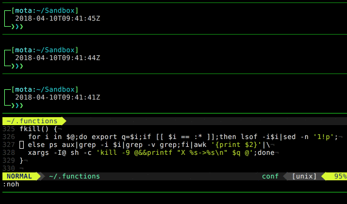

# fkill

> A simple 3 line bash function to kill process by name or port (like [fkill](https://www.npmjs.com/package/fkill-cli) NPM package, but not taking up your entire disk space with node_modules)



## Install

```bash
wget https://raw.githubusercontent.com/miguelmota/fkill/master/fkill.sh
chmod +x fkill.sh
sudo mv fkill.sh /usr/local/bin/fkill
```

## usage

```
$ fkill [process_name] [:process_port]
```

## License

MIT

